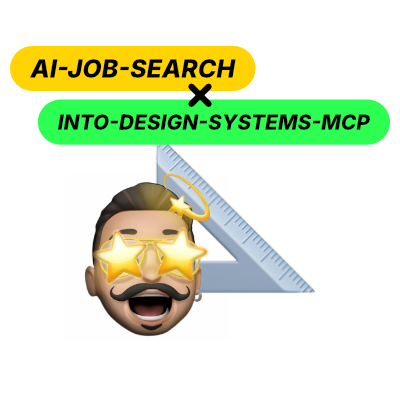

# Into Design Systems MCP adapter for ai-job-search

A portable job-source adapter for [Into Design Systems Jobs](https://jobs.intodesignsystems.com/mcp), built to plug into [MadsLorentzen/ai-job-search](https://github.com/MadsLorentzen/ai-job-search).

It searches design-systems, product-design, and AI-adjacent roles through the Into Design Systems read-only MCP server, then emits the normalized job records expected by ai-job-search. The shared Bun CLI is deliberately independent of a single AI client: the same adapter can be used from Claude Code or Codex.

## Why this exists

The job board publishes its own MCP server, and connecting it directly takes one command:

```bash
claude mcp add -s user --transport http ids-jobs https://jobs.intodesignsystems.com/mcp
```

If you want to chat with the board, do that instead. This adapter adds nothing.

It exists for the other case: feeding the board into ai-job-search's pipeline. That framework's `/scrape` command discovers job sources by globbing `.agents/skills/*/SKILL.md`, shelling out to each one's CLI with `--format json`, and pooling the normalized records — then deduplicating them against everything already in `seen_jobs.json`, scoring them with `/rank`, and tracking applications through `/apply`. A directly connected MCP server is invisible to all of that. It answers questions in a chat; it does not put rows in the pool.

So this adapter is a translation layer: MCP on one side, the portal `search`/`detail` contract on the other. Its results get deduplicated against your LinkedIn hits, ranked against your profile, and tracked like every other source.

## What it does

- Searches the Into Design Systems board with keyword, country, work-arrangement, date-window, and result-limit filters.
- Fetches full details for a specific job slug or detail URL.
- Normalizes results to the ai-job-search job-record shape.
- Keeps job research separate from applying: it never fills forms or submits applications.

The public service is free, requires no account or API key, and is read-only. Its availability and result quality remain the responsibility of Into Design Systems.

## Install in ai-job-search

Upstream treats portal skills as a module system, and copying one in from another repository is the documented way to add a board it does not ship — [its README](https://github.com/MadsLorentzen/ai-job-search#extending-the-framework-portals-templates-criteria---and-borrowing-from-other-forks) calls this "the intended way to get a board that upstream doesn't ship," with the copy step manual on purpose so that you read the code first.

### Read it before you run it

Portal CLIs are pre-approved in `.claude/settings.json` and run against your career data, so upstream asks you to audit any skill you borrow. This one is built to make that quick: 467 lines of source, and a table of where to look:

| Upstream's check | This adapter |
| --- | --- |
| Only calls the board it claims to search | One URL, defined once in [`cli/src/helpers.ts`](adapter/into-design-systems-search/cli/src/helpers.ts) and used for every request |
| No `dependencies`, no lifecycle scripts | [`package.json`](adapter/into-design-systems-search/cli/package.json) has an empty `dependencies` and no `postinstall`. Nothing is installed to run the skill; the only dev dependencies are TypeScript and type stubs, used by `bun run typecheck` |
| Reads and writes nothing outside its folder | No filesystem access at all — stdout and stderr only |
| Tests pass offline | `bun test` stubs every network call; run it with your wifi off |

### Copy it in

```bash
rsync -a --exclude node_modules adapter/into-design-systems-search \
  /path/to/ai-job-search/.agents/skills/
```

**There is no install step.** The CLI has zero runtime dependencies and Bun runs
TypeScript directly, so the copied folder works immediately. Do not run
`bun install` in it — that pulls ~29 MB of dev-only TypeScript compiler you do
not need to run the skill, and it is why the command above excludes
`node_modules` (a plain `cp -R` from a checkout you have already developed in
would copy it). The installed skill is about 76 KB.

The source is intentionally visible under `adapter/` so the copy target is unambiguous. In the target repository, it must end up at:

```text
.agents/skills/into-design-systems-search/
```

`/scrape` auto-discovers it from there — nothing to register or wire up. In Codex, select or type the exact skill name `into-design-systems-search`; in Claude Code, invoke the same skill from the repository. Both clients use the same CLI and data contract. Set `enabled: false` in `SKILL.md` to keep it installed but have `/scrape` skip it.

### Use a local checkout directly

If both repositories are local and you want adapter changes to take effect without copying them again, link the standalone checkout into ai-job-search's normal skill-discovery directory:

```bash
ln -s /absolute/path/to/into-design-systems-mcp-adapter/adapter/into-design-systems-search \
  /absolute/path/to/ai-job-search/.agents/skills/into-design-systems-search
```

This is only a local installation link. The adapter remains owned, versioned, and published by this standalone repository. ai-job-search discovers it in exactly the same place as a copied external adapter.

## Adapter commands

From the copied skill's `cli/` folder:

```bash
bun run src/cli.ts search --query "design systems" --country Germany --limit 10 --format json
bun run src/cli.ts search --jobage 60 --before 2026-08-01 --format table
bun run src/cli.ts detail gitlab-senior-product-designer-ai-dtkb4g --format plain
```

Run `bun run src/cli.ts --help` for all flags. The board has no offset paging, so a truncated search is narrowed by pairing `--jobage` with `--before` and walking backwards in date windows. The skill instructions and field mapping are in [SKILL.md](adapter/into-design-systems-search/SKILL.md) and [url-reference.md](adapter/into-design-systems-search/url-reference.md).

## Compatibility and scope

- Runtime: Bun 1.0+. Zero runtime dependencies.
- Host workflow: ai-job-search's isolated portal-skill architecture.
- AI clients: Codex and Claude Code, through one portable skill and CLI.
- Scope: a **specialization** board, not a national one. Into Design Systems curates Design System roles worldwide, so use `--country` to narrow it to a market rather than expecting it to cover one.
- No browser scraping, authentication, automatic form filling, or automatic submission.

## Credits

- **Sil Bormüller** ([silships](https://github.com/silships)), founder of Into Design Systems, built and maintains the job board and the MCP service that powers this adapter.
- Read Sil's [MCP Design Job Board announcement](https://intodesignsystems.substack.com/p/mcp-design-job-board) and explore the [Into Design Systems job board](https://jobs.intodesignsystems.com/).
- This adapter follows the skill and normalized-record conventions of [MadsLorentzen/ai-job-search](https://github.com/MadsLorentzen/ai-job-search), whose `linkedin-search` skill is the reference implementation of the pattern.

I have no affiliation with Into Design Systems or Sil Bormüller. I built this independently as an external adapter for ai-job-search; it is not a fork of ai-job-search, and it is not affiliated with or endorsed by Into Design Systems, Sil Bormüller, Mads Lorentzen, Anthropic, or OpenAI.

## Attribution and license

Released under the [MIT License](LICENSE), which covers this adapter and nothing else. [NOTICE](NOTICE) records exactly what is adapted from [ai-job-search](https://github.com/MadsLorentzen/ai-job-search) — its conventions and normalized record contract, with its copyright notice retained — and sets out the boundary around the job board: the Into Design Systems MCP service is called over the network, never bundled here, so the postings retrieved through it belong to Into Design Systems and the employers who list with it, and stay subject to that service's own terms. Use it responsibly.

## Contributing

Contributions are welcome: bug reports, field-mapping fixes, test cases, documentation improvements, and compatibility feedback are all useful. Please read [CONTRIBUTING.md](CONTRIBUTING.md) before opening an issue or pull request. Never include candidate data, saved searches, application records, credentials, or other personal information.
